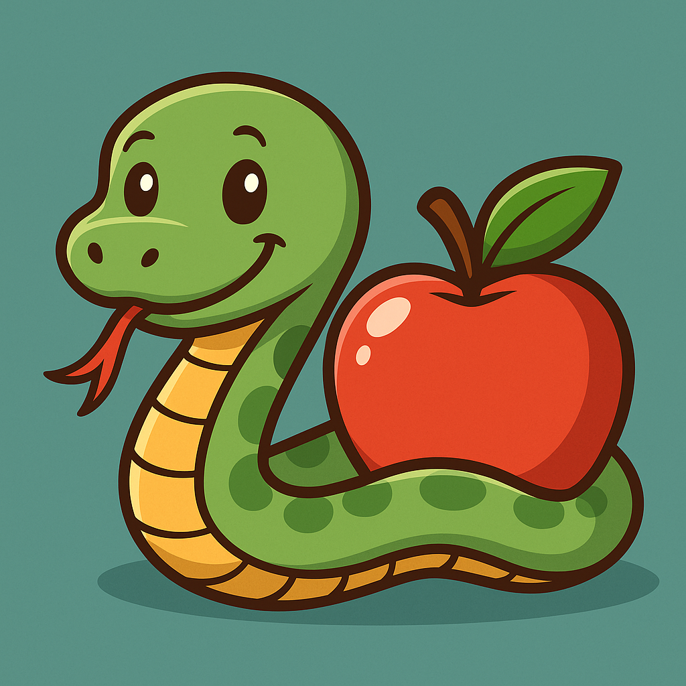

# 🐍 Snake con Webcam

---


Este proyecto es una versión moderna del clásico juego **Snake**, donde **controlas la serpiente con el dedo índice** usando la cámara web y visión por computador (MediaPipe). Además, incluye comida, skins personalizadas, un cronómetro de 2 minutos, y registro de partidas jugadas.

---

## 📸 ¿Cómo funciona?

- Se utiliza la cámara web para detectar la posición del dedo índice.
    
- La serpiente sigue el movimiento del dedo.
    
- Cuando la cabeza de la serpiente colisiona con la comida, esta crece y aumenta tu puntuación.
    
- La partida termina a los **2 minutos** y se guarda el resultado automáticamente en un archivo.

---

## ⚙️ Instalación

1. **Clona el repositorio:**
    

```bash
git clone https://github.com/HugoAlFus/Snake-python
cd Snake-python
```

2. **Crea un entorno virtual (opcional pero recomendado):**
    

```bash
python -m venv venv
source venv/bin/activate  # En Linux/macOS
venv\Scripts\activate     # En Windows
```

3. **Instala las dependencias:**
    

```bash
pip install -r requirements.txt
```

> Si no tienes un `requirements.txt`, puedes instalar manualmente:

```bash
pip install opencv-python mediapipe
```

---

## ▶️ Cómo ejecutar el juego

Ejecuta el archivo `main.py`:

```bash
python snake_game/main.py
```

---

## 💾 Registro de partidas

Cada partida guarda automáticamente un archivo con el nombre del momento en que se jugó:

```
matchs/
├── 16-04-53.txt
├── 16-04-53 Score-5 Time-120.txt
```

Cada archivo incluye:

```
Score: 5
Time: 120
```

---

## 🖼️ Personalización

- Puedes cambiar la imagen de la serpiente o la comida editando los archivos en:
    
    ```
    assets/sprites/snake/snake_segment.png
    assets/sprites/snake/snake_head.png
    assets/sprites/food/apple.png
    ```
    
    Asegúrate de que tengan canal alfa (transparencia) y sean de tamaño similar.
    

---

## 🧠 Requisitos

- Python 3.7 o superior
    
- Webcam funcional
    
- Bibliotecas:
    
    - OpenCV
        
    - MediaPipe
        

---

## ✅ Pendiente por mejorar (ideas)

- Detección de colisiones con uno mismo
    
- Agregar niveles o velocidades
    
- Soporte para pausa/reanudar
    
- Guardado con fecha completa (día/mes/año)

---
## 🙌 Créditos

Proyecto desarrollado por:

**Hugo Almodóvar Fuster**  
🌐 [https://hugoalfus.github.io/](https://hugoalfus.github.io/)  
🔗 [LinkedIn](https://www.linkedin.com/in/hugoalmodovar/)